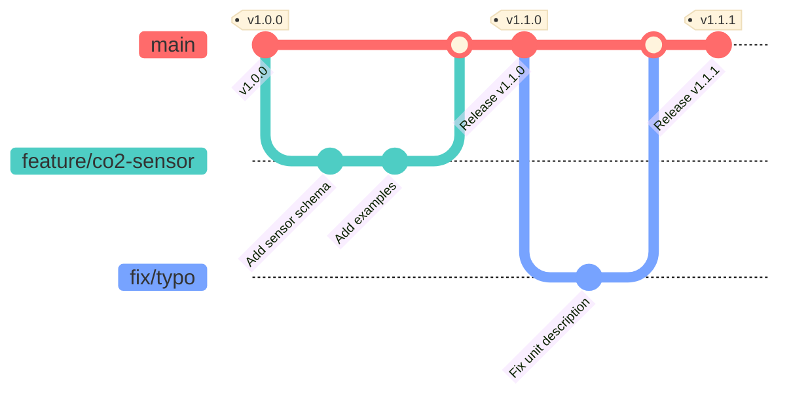

# スマートビルデータモデルへの貢献ガイド

スマートビルデータモデル・リポジトリ（以下、本プロジェクト）への貢献に関心をお寄せいただきありがとうございます。
本リポジトリは、システム間で交換される**データの構造（Schema）と定義**を LinkML で管理し、OWL・SHACL・JSON Schema・ドキュメントを自動生成するプロジェクトです。

## 受け付けるコントリビューション

- **Issue**: どなたでも、バグ報告・データモデルの追加要望・改善提案を作成できます。
- **Pull Request**: Smart Building Co-creation Organization が管理する同一リポジトリ内のブランチからのみ受け付けます。外部 fork からの PR は受け付けず、自動的に案内コメントを付けてクローズします。

外部の方が具体的な変更案をお持ちの場合も、コードやスキーマを PR として送るのではなく、再現例・期待する定義・利用事例を Issue に記載してください。Datamodel TF が内容を検討し、必要な変更を組織内のブランチで実装します。

この制限は、標準案への提案を閉じるものではありません。提案窓口を Issue に統一し、標準化の議論と実装責任を明確にするための運用です。


## 1. 開発環境のセットアップ

### 必須ツール
- **Python**: 3.11 以上
- **Git**: 最新版

### セットアップ手順

```bash
# 1. リポジトリをクローン
git clone https://github.com/smartbuilding-co-creation-organization/smartbuilding_datamodels.git
cd smartbuilding_datamodels

# 2. 仮想環境の作成と有効化
python -m venv .venv
source .venv/bin/activate          # macOS / Linux
# .venv\Scripts\activate           # Windows (PowerShell)

# 3. 依存パッケージのインストール
pip install -r requirements.txt
```

Windows では `Makefile` の代わりに `make.ps1` が使用できます：

```powershell
powershell -ExecutionPolicy Bypass -File .\make.ps1 install
```

### 推奨エディタ設定 (VS Code)
- **YAML**: スキーマファイルの構文ハイライトとフォーマット
- **Prettier**: コードフォーマッター


## 2. ディレクトリ構造

```
.
├── schema/
│   ├── building_model_owl.yaml    # OWL 出力用 LinkML スキーマ
│   └── building_model_shacl.yaml  # SHACL / JSON Schema / Docs 用 LinkML スキーマ
├── output/                        # 生成物 (コミット対象・手動編集禁止)
│   ├── building_model.owl.ttl
│   ├── building_model.shacl.ttl
│   └── building_model.schema.json
├── docs/                          # 生成ドキュメント (コミット対象・手動編集禁止)
├── sample/
│   ├── buildingA.yaml             # サンプルデータ
│   └── validation/                # SHACL 検証ケース
│       └── cases.yaml
├── scripts/                       # 変換・検証スクリプト
├── Makefile                       # ビルド・検証コマンド (Linux / macOS)
├── make.ps1                       # ビルド・検証コマンド (Windows PowerShell)
└── requirements.txt               # Python 依存パッケージ
```

> `output/` と `docs/` は `make gen` で自動生成されます。**直接編集しないでください。**


## 3. 開発フロー (GitHub Flow)

本プロジェクトは **GitHub Flow** で運用されています。`develop` ブランチは存在せず、**`main` ブランチが常に正本（Source of Truth）** となります。

### ブランチ戦略図



### 手順

1. **Issue 作成**: 新しいデータモデルの要望や、既存定義の誤りを報告します。
2. **ブランチ作成**: `main` から作業用ブランチを作成します。
   - `feature/xxx`（モデル追加など）
   - `fix/xxx`（修正など）
3. **スキーマ編集**: 目的に応じてスキーマファイルを編集します（後述）。
4. **生成物の更新**: `make gen` で出力ファイルを再生成します。
5. **検証**: `make validate` でスキーマと SHACL 検証を実行します。
6. **サンプル作成**: 必要に応じて `sample/validation/cases.yaml` に検証ケースを追加します。
7. **Pull Request**: 組織内の作業ブランチから `main` へ PR を作成します。`main` への直接 push は行いません。


## 4. スキーマ編集ガイドライン

### 編集対象ファイルの使い分け

| 目的 | 編集ファイル |
|------|------------|
| OWL クラス・プロパティの定義 | `schema/building_model_owl.yaml` |
| SHACL シェイプ・JSON Schema・Docs | `schema/building_model_shacl.yaml` |

通常は **両ファイルを同期して** 編集します。OWL 固有の記述（`owl_metadata`、`any_of` など）を除き、クラス・スロット・列挙型の定義内容は同一に保ってください。

### 命名規則

- **クラス名**: `PascalCase`（例: `EquipmentExt`、`PointExt`）
- **スロット名**: `camelCase`（例: `hasPoint`、`isPartOf`）
- **列挙値**: `PascalCase` または `snake_case`（既存の定義に合わせること）
- **スキーマファイル名**: `snake_case.yaml`

### スキーマ記述のポイント

- **`description`**: すべてのクラス・スロット・列挙値に英語で記述してください。
- **`range`**: スロットの値型は明示的に指定してください（`string`、`integer`、カスタム型、他クラスなど）。
- **`multivalued`**: 複数の値を持てる場合は `true` を指定してください。
- **`required`**: 必須フィールドには `true` を指定してください。
- **`inlined_as_list`**: 子要素をリストとしてインライン展開する場合に指定してください。
- **カーディナリティ変更の注意**: 既存スロットへの `required: true` 追加は破壊的変更です（後述）。

### 後方互換性

既存システムへの影響を防ぐため、以下の変更は慎重に行ってください（破壊的変更となります）：

- 既存クラス・スロットの**削除**
- 既存スロットの**型（range）変更**
- 既存スロットへの**必須（required）制約の追加**

新しい任意スロットの追加・`required` 制約の削除は互換性のある変更です。


## 5. ビルドと検証

### 主要な Make ターゲット

```bash
make install   # venv 作成 + requirements.txt インストール
make gen       # OWL / SHACL / JSON Schema / Docs をすべて再生成
make serve     # Docs を再生成して MkDocs プレビューサーバーを起動
make validate  # gen 実行後、sample/validation/cases.yaml でRDF検証
make clean     # MkDocs の site/ ディレクトリを削除
```

### 検証ケースの追加

`sample/validation/cases.yaml` に SHACL の合否テストを追加できます。新しいクラス・制約を追加した場合は、対応する検証ケースを必ず追加してください。

```yaml
# cases.yaml の例
cases:
  - id: valid_minimal_point
    file: valid_minimal.yaml
    expect_conformant: true
  - id: invalid_missing_name
    file: invalid_missing_name.yaml
    expect_conformant: false
```


## 6. コミット規約 (Conventional Commits)

リリースノート自動生成のため、以下の形式に従ってください。

| Type | バージョン | 説明 |
|------|----------|------|
| **feat** | Minor | 新しいクラス・スロット・列挙値の追加 |
| **fix** | Patch | 説明文の修正、バリデーション制約の微修正 |
| **docs** | Patch | README・ガイドラインの更新 |
| **refactor** | Patch | スキーマ構造の整理（定義内容は変わらない） |

### 破壊的変更がある場合

```
feat(schema): 機器IDの形式制約を変更

BREAKING CHANGE: Equipment.id の文字列パターンが変更されました。
```


## 7. Pull Request ガイドライン

この節は、リポジトリへの Write 権限を持つ Datamodel TF および組織内メンバー向けです。外部からの変更提案は Issue を利用してください。

PR には以下のチェックリストを含めてください。

### チェックリスト

- [ ] `make validate` が通過すること
- [ ] `make gen` を実行し、生成物（`output/`・`docs/`）を最新化してコミットしていること
- [ ] 追加・変更したクラス・スロットに `description` が記載されていること
- [ ] 破壊的変更がある場合はコミットメッセージに `BREAKING CHANGE:` を記載していること
- [ ] 必要に応じて `sample/validation/cases.yaml` に検証ケースを追加していること


## 8. リリースプロセス

PR が `main` にマージされると、GitHub Actions により以下が自動実行されます。

1. LinkML から OWL / SHACL / JSON Schema / Docs を再生成
2. MkDocs でドキュメントをビルド
3. GitHub Pages へデプロイ（`gh-pages`）


## 9. サポート

- **モデルの利用方法・設計相談・バグ報告・追加要望**: [Issues](https://github.com/smartbuilding-co-creation-organization/smartbuilding_datamodels/issues)

データモデルはスマートビルの共通言語です。分かりやすく、使いやすい定義へのご協力をお願いします。

## 10. コントリビューションのライセンス

明示的に別段の記載がない限り、コントリビューションは変更対象ファイルに
適用されるライセンスの下で提供されます。オントロジーおよび文書には
CC BY 4.0、ソフトウェアおよび自動化設定には Apache License 2.0 が
適用されます。詳細は [LICENSE](LICENSE) を確認してください。

コントリビューターは、提出する内容をこの条件で提供する権限を有している
ことを確認してください。
