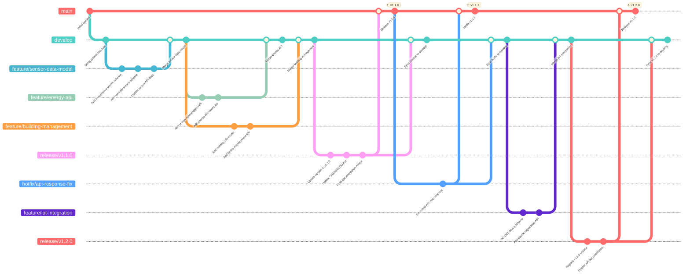

# スマートビルデータモデル・API仕様管理リポジトリ運用方針

## 1. ブランチ戦略

### メインブランチ構成

```
main (本番用・安定版)
├── develop (開発統合ブランチ)
├── feature/* (機能開発ブランチ)
├── release/* (リリース準備ブランチ)
└── hotfix/* (緊急修正ブランチ)

```

### ブランチ運用ルール

- **main**: 常に本番デプロイ可能な状態を維持
- **develop**: 次期リリース向けの統合ブランチ
- **feature/**: 新機能・仕様追加用（例：`feature/sensor-data-model`）
- **release/**: リリース前の最終調整用（例：`release/v1.1.0`）
- **hotfix/**: 緊急バグ修正用（例：`hotfix/v1.1.1`）



## 2. Pull Request（PR）規約

### PRサイズ・スコープ管理

- **ファイル数**: 10ファイル以内を推奨
- **1つのテーマ**: バグ修正と新機能追加を混在させない
- **頻繁なマージ**: 小さな変更を頻繁にマージしてコンフリクトを回避

### レビュー・承認ルール

- **必須承認者数**: 最低1人（重要な変更は2人）
- **再承認**: 承認後の変更には再度承認が必要
- **ブランチ保護**: GitHub branch protection設定で強制

### PRテンプレート

```markdown
## 変更概要
<!-- 何を変更したか簡潔に記述 -->

## 変更理由・目的
<!-- なぜこの変更が必要か -->

## 変更内容
<!-- 具体的な変更点をリスト形式で -->
- [ ] データモデルの追加/変更
- [ ] API仕様の追加/変更
- [ ] ドキュメントの更新
- [ ] スキーマの修正

## 影響範囲
<!-- この変更が影響する範囲 -->
- [ ] 既存APIとの互換性: 有/無
- [ ] データモデルへの影響: 有/無
- [ ] ドキュメント更新: 必要/不要

## テスト・検証
- [ ] OpenAPI仕様の構文チェック完了
- [ ] JSONスキーマの妥当性確認完了
- [ ] サンプルデータでの動作確認完了

## 関連Issue
Closes #[Issue番号]

## レビュー観点
<!-- レビュアーに特に確認してほしい点 -->

```

## 3. Commit規約

### コミットルール

- **1コミット = 1つの変更**: 追跡・復元を容易にする
- **小さなコミット**: 大きな変更は複数のコミットに分割
- **意味のあるメッセージ**: 何を、なぜ行ったかを明確に記述

### コミットメッセージフォーマット

```
[タイプ] 概要
詳細な説明（option）

```

### タイプ定義

- **feat**: 新しい機能・仕様の追加
- **fix**: バグ・不具合の修正
- **docs**: ドキュメントのみの変更
- **style**: フォーマット、空白などの修正
- **refactor**: 仕様に影響がないコード改善
- **perf**: パフォーマンス向上関連
- **test**: テスト関連の変更
- **chore**: ビルド、補助ツール、ライブラリ関連

### コミットメッセージ例

```
[feat] センサーデータモデルの追加

[fix] APIレスポンス形式の修正
仕様書と実装が異なっていたため、OpenAPI仕様に合わせて修正

[docs] データモデル利用ガイドの更新
新しいセンサータイプに対応した例を追加

```

### コミットテンプレート設定

```bash
# .github/.gitmessage.txt
[feat/fix/docs/style/refactor/perf/test/chore] 概要(〇〇なため、△△を追加)
詳細な説明（option）

# Please enter the commit message for your changes. Lines starting
# with '#' will be ignored, and an empty message aborts the commit.
#
# コミットタイプ:
# feat: 新しい機能・仕様の追加
# fix: バグ・不具合の修正
# docs: ドキュメントのみの変更
# style: フォーマット、空白などの修正
# refactor: 仕様に影響がないコード改善
# perf: パフォーマンス向上関連
# test: テスト関連の変更
# chore: ビルド、補助ツール、ライブラリ関連

```

```bash
# 設定コマンド
git config --local commit.template .github/.gitmessage.txt

```

## 4. Issue管理

### Issueテンプレート設定

```markdown
## 機能要求 (Feature Request)
- 概要
- 背景・目的
- 受入条件
- 関連するデータモデル/API
- 想定ファイル変更数

## バグ報告 (Bug Report)
- 現象
- 再現手順
- 期待する動作
- 影響範囲

## 仕様変更 (Specification Change)
- 変更内容
- 変更理由
- 互換性への影響
- 移行計画

```

### ラベル体系

- **Type**: `feature`, `bug`, `documentation`, `breaking-change`
- **Priority**: `critical`, `high`, `medium`, `low`
- **Component**: `data-model`, `api-spec`, `schema`, `examples`
- **Status**: `in-progress`, `review-needed`, `blocked`
- **Size**: `small`, `medium`, `large` (PR規模の目安)

## 5. 品質管理・自動化

### GitHub Actions設定

```yaml
# .github/workflows/pr-validation.yml
name: PR Validation
on:
  pull_request:
    types: [opened, synchronize, reopened]

jobs:
  validate:
    runs-on: ubuntu-latest
    steps:
      - uses: actions/checkout@v3

      - name: Check PR Size
        uses: actions/github-script@v6
        with:
          script: |
            const { data: files } = await github.rest.pulls.listFiles({
              owner: context.repo.owner,
              repo: context.repo.repo,
              pull_number: context.issue.number,
            });

            if (files.length > 10) {
              core.setFailed(`PR contains ${files.length} files. Please keep it under 10 files.`);
            }

      - name: Validate OpenAPI
        run: |
          npm install -g swagger-parser
          find specs/openapi -name "*.yaml" -exec swagger-parser validate {} \\;

      - name: Validate JSON Schema
        run: |
          npm install -g ajv-cli
          find schemas -name "*.json" -exec ajv validate -s {} \\;

```

### ブランチ保護設定

```yaml
# 設定項目
- Require pull request reviews before merging: ✓
- Required approving reviews: 1
- Dismiss stale reviews when new commits are pushed: ✓
- Require status checks to pass before merging: ✓
- Require branches to be up to date before merging: ✓
- Include administrators: ✓

```

## 6. ドキュメント・バージョン管理

### ディレクトリ構造

```
├── .github/
│   ├── .gitmessage.txt          # コミットテンプレート
│   ├── PULL_REQUEST_TEMPLATE.md # PRテンプレート
│   └── workflows/               # GitHub Actions
├── docs/
│   ├── api/                     # API仕様書
│   ├── data-models/             # データモデル定義
│   ├── schemas/                 # JSONスキーマ
│   ├── examples/                # 実装例
│   └── guides/                  # 導入ガイド
├── specs/
│   ├── openapi/                 # OpenAPI仕様
│   └── json-schema/             # JSONスキーマファイル
├── CONTRIBUTING.md              # 貢献ガイドライン
├── CHANGELOG.md                 # 変更履歴
└── README.md                    # ReadMe
```

### バージョニング

- **Major (x.0.0)**: 破壊的変更
- **Minor (x.y.0)**: 後方互換性のある機能追加
- **Patch (x.y.z)**: 後方互換性のあるバグ修正

### **リリース管理**

```yaml
yaml
# .github/workflows/release.yml
name: Release
on:
  push:
    tags: ['v*']
jobs:
  release:
    runs-on: ubuntu-latest
    steps:
      - name: Generate Release Notes
      - name: Publish Documentation
      - name: Create GitHub Release
```

## 7. コミュニティ管理・ガイドライン

### 必須ファイル詳細

### [CONTRIBUTING.md](http://contributing.md/)

```markdown
# スマートビルデータモデル・API仕様への貢献ガイド

## 貢献の流れ

1. **Issue作成**: 機能要求・バグ報告・仕様変更の提案
2. **ブランチ作成**: `feature/`, `fix/`, `docs/`等の適切なプレフィックス
3. **開発・ドキュメント作成**: 小さなコミットで段階的に実装
4. **Pull Request作成**: テンプレートに従って詳細を記載
5. **レビュー・修正**: 承認を得るまで対話的に改善
6. **マージ**: 承認後、適切なタイミングでマージ

## コミット・PR規約

### コミットサイズの目安
- 1つのファイルの小さな修正: 1コミット
- 関連する複数ファイルの修正: 1コミット
- 大きな機能追加: 複数の小さなコミットに分割

### PRサイズの目安
- **Small**: 1-5ファイル、軽微な修正・追加
- **Medium**: 6-15ファイル、中程度の機能追加
- **Large**: 16-20ファイル、大きな機能追加（要事前相談）

## レビュー観点

### データモデル関連
- [ ] 既存モデルとの整合性
- [ ] 命名規則の遵守
- [ ] 必須/任意フィールドの適切性
- [ ] データ型の妥当性

### API仕様関連
- [ ] RESTful設計原則の遵守
- [ ] HTTPステータスコードの適切性
- [ ] エラーレスポンスの統一性
- [ ] セキュリティ考慮事項

### ドキュメント関連
- [ ] 技術的正確性
- [ ] 理解しやすさ
- [ ] サンプルコードの動作確認
- [ ] リンク切れの確認

```

### CODE_OF_CONDUCT.md

```markdown
# 行動規範

## 私たちの約束

スマートビル業界の発展とオープンな技術標準の推進のため、
すべての参加者にとって安全で建設的な環境を提供します。

## 期待される行動

- 技術的な議論に集中する
- 建設的なフィードバックを提供する
- 異なる意見や経験を尊重する
- 初心者に対して親切で教育的な態度を取る

## 禁止される行動

- 個人攻撃や侮辱的な言動
- 技術的根拠のない批判
- 商用製品の過度な宣伝
- 機密情報の不適切な開示

```

### [SECURITY.md](http://security.md/)

```markdown
# セキュリティポリシー

## 報告方法

セキュリティ上の懸念がある場合は、公開のIssueではなく、
以下の方法で報告してください：

- Email: security@smartbuilding-specs.org
- 暗号化が必要な場合: GPG Key [公開鍵ID]

## 対応プロセス

1. **24時間以内**: 受信確認
2. **72時間以内**: 初期評価と対応方針の決定
3. **1週間以内**: 修正版の準備（重要度による）
4. **修正完了後**: 公開での報告と謝辞

```

## 8. 運用監視・メトリクス

### 品質メトリクス

```yaml
# .github/workflows/metrics.yml
name: Repository Metrics
on:
  schedule:
    - cron: '0 0 * * 0'  # 週次実行

jobs:
  metrics:
    runs-on: ubuntu-latest
    steps:
      - name: PR Size Analysis
        # 過去1週間のPRサイズ分布を分析

      - name: Review Time Analysis
        # レビュー完了までの時間を測定

      - name: Documentation Coverage
        # API仕様に対するドキュメント網羅率

      - name: Schema Validation Rate
        # スキーマ検証の成功率

```

### 定期レビュー項目

- **月次**: PRサイズ・レビュー時間の傾向分析
- **四半期**: ドキュメント品質・利用状況の評価
- **半年**: 運用プロセスの見直し・改善

## 9. リリース管理詳細

### リリースプロセス

```bash
# 1. リリースブランチ作成
git checkout develop
git checkout -b release/v1.2.0

# 2. バージョン情報更新
# - package.json, openapi.yaml等のバージョン番号
# - CHANGELOG.mdの更新

# 3. 最終テスト・ドキュメント確認
npm run validate-all
npm run generate-docs

# 4. リリースPR作成（develop → main）
# 5. 承認後マージ・タグ作成
git tag v1.2.0
git push origin v1.2.0

# 6. GitHub Release作成（自動化）

```

### [CHANGELOG.md](http://changelog.md/) フォーマット

```markdown
# Changelog

## [Unreleased]
### Added
### Changed
### Deprecated
### Removed
### Fixed
### Security

## [1.2.0] - 2024-01-15
### Added
- [feat] 新しいセンサーデータモデル（温湿度センサー）
- [feat] エネルギー管理API v2の追加

### Changed
- [refactor] 既存APIレスポンス形式の統一化

### Fixed
- [fix] OpenAPIスキーマの型定義エラー修正

```

## 10. トラブルシューティング・FAQ

### よくある問題と対処法

### PRが大きすぎる場合

```bash
# 機能別に分割してコミット
git reset --soft HEAD~3  # 直近3コミットを取り消し
# 機能ごとに再コミット
git add schemas/sensor-temperature.json
git commit -m "[feat] 温度センサーのスキーマ追加"

git add docs/api/sensor-api.md
git commit -m "[docs] センサーAPI利用ガイド追加"

```

### コンフリクト解決

```bash
# developブランチの最新を取得
git checkout develop
git pull origin develop

# featureブランチでrebase
git checkout feature/sensor-model
git rebase develop

# コンフリクト解決後
git add .
git rebase --continue

```

### 緊急修正（hotfix）フロー

```bash
# mainから直接ブランチ作成
git checkout main
git checkout -b hotfix/critical-api-fix

# 修正・テスト・コミット
git add .
git commit -m "[fix] APIエンドポイントの緊急修正"

# main・developの両方にマージ
git checkout main
git merge hotfix/critical-api-fix
git checkout develop
git merge hotfix/critical-api-fix

# タグ作成
git tag v1.1.1

```

## 11. 外部連携・統合

### CI/CD統合

- **Swagger Codegen**: API仕様からクライアントライブラリ自動生成
- **Redoc/Swagger UI**: API仕様の自動公開
- **JSON Schema Store**: スキーマの外部参照対応

### 通知設定

```yaml
# Slack通知設定例
- name: Notify Slack
  if: failure()
  uses: 8398a7/action-slack@v3
  with:
    status: ${{ job.status }}
    channel: '#smartbuilding-dev'
    webhook_url: ${{ secrets.SLACK_WEBHOOK }}

```
