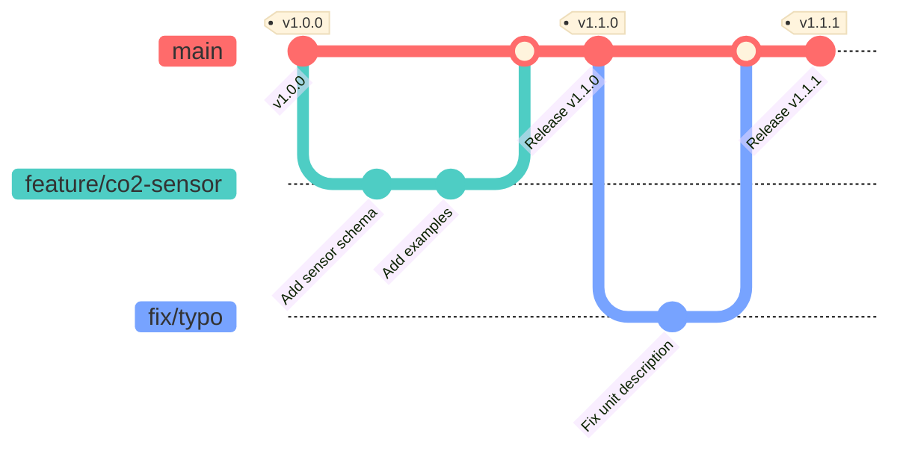

# CONTRIBUTING.md (データモデル用)

```markdown
# スマートビルデータモデルへの貢献ガイド

スマートビルデータモデル・リポジトリ（以下、本プロジェクト）への貢献に関心をお寄せいただきありがとうございます。
本リポジトリは、システム間で交換される**データの構造（Schema）と定義**を管理するものであり、APIの通信仕様とは分離されています。

データの相互運用性を担保するため、以下のガイドラインに従って貢献をお願いいたします。

---

## 1. 開発環境のセットアップ

正確なスキーマ定義と検証のために、以下の環境推奨設定を行ってください。

### 必須ツール
- **Node.js**: v18以上 (スキーマ検証ツール実行用)
- **Git**: 最新版

### 推奨エディタ設定 (VS Code)
本リポジトリには `.vscode/extensions.json` が含まれています。
- **JSON / YAML**: スキーマファイルの構文ハイライトとフォーマット
- **Prettier**: コードフォーマッター

### セットアップ手順
```bash
# リポジトリのクローン
git clone https://github.com/your-org/smart-building-data-models.git
cd smart-building-data-models

# 依存関係（検証ツール: AJV, json-schema-ref-parser等）のインストール
npm install

# 動作確認（既存スキーマの検証）
npm run validate
```

---

## 2. ディレクトリ構造

本リポジトリは以下の構造で管理されています。新規追加の際は適切なディレクトリに配置してください。

```
.
├── schemas/           # データモデル定義 (JSON Schema)
│   ├── common/        # 共通定義 (住所、単位など)
│   ├── devices/       # 設備・機器モデル (センサー、空調機など)
│   └── spaces/        # 空間モデル (部屋、フロアなど)
├── examples/          # 実装例・サンプルデータ (JSON)
├── docs/              # 設計思想・ガイドライン
└── package.json       # 検証スクリプト定義
```

---

## 3. 開発フロー (GitHub Flow)

本プロジェクトは **GitHub Flow** で運用されています。`develop` ブランチは存在せず、**`main` ブランチが常に正本（Source of Truth）**となります。

### ブランチ戦略図



### 手順
1. **Issue作成**: 新しいデータモデルの要望や、既存定義の誤りを報告します。
2. **ブランチ作成**: `main` から作業用ブランチを作成します。
   - `feature/xxx` (モデル追加など)
   - `fix/xxx` (修正など)
3. **編集・コミット**: 定義ファイルを作成・修正します。
4. **サンプル作成**: **必須**。モデルに対応するサンプルデータを `examples/` に追加してください。
5. **ローカル検証**: `npm run validate` でスキーマの構文チェックを行います。
6. **Pull Request**: `main` へPRを作成します。

---

## 4. モデリング・記述ガイドライン

データの相互運用性を維持するため、以下の規則を厳守してください。

### 命名規則
- **フィールド名**: `camelCase` (例: `temperatureValue`, `createdAt`)
- **ファイル名**: `kebab-case.json` (例: `temperature-sensor.json`)
- **Enum値**: 原則 `SCREAMING_SNAKE_CASE` または `camelCase` (統一すること)

### スキーマ設計 (JSON Schema)
- **$id の記述**: スキーマファイルには必ず一意な `$id` を記述してください。
- **説明文 (description)**: 全てのフィールドに日本語で `description` を記述してください。
- **型制約**: 可能な限り厳密に定義してください。
    - 数値: `minimum`, `maximum`, `multipleOf` (小数点以下の桁数制御) を検討する。
    - 文字列: `pattern` (正規表現) や `minLength` を指定する。
    - 配列: `minItems`, `uniqueItems` を指定する。
- **共通化**: 汎用的な定義（タイムスタンプ、ID形式、住所情報など）は `schemas/common/` 以下の定義を `$ref` で参照してください。

### 後方互換性
既存システムへの影響を防ぐため、以下の変更は慎重に行ってください（破壊的変更となります）。
- 既存フィールドの**削除**
- 既存フィールドの**型変更**
- 既存フィールドへの**必須(Required)制約の追加**

※ 必須制約を外す、新しい任意フィールドを追加する等は、互換性のある変更です。

---

## 5. コミット規約 (Conventional Commits)

リリースノート自動生成のため、以下の形式に従ってください。

| Type | バージョン | 説明 |
| --- | --- | --- |
| **feat** | Minor | 新しいデータモデルの追加、任意フィールドの追加 |
| **fix** | Patch | 説明文の修正、バリデーション正規表現の微修正 |
| **docs** | Patch | READMEやガイドラインの更新 |
| **refactor**| Patch | `$ref` 構造の整理（定義内容は変わらない） |

### 破壊的変更がある場合
必須フィールドの追加など、利用側の修正が必要な場合はフッターに記載してください。
```
feat(device): 機器IDの形式を変更

BREAKING CHANGE: deviceIdのフォーマットがUUID v4必須になりました。
```

---

## 6. Pull Request ガイドライン

PRには以下のチェックリストを含めてください。

### チェックリスト
- [ ] **スキーマ定義**: 構文エラーがないこと (`npm run validate` 通過)
- [ ] **サンプルデータ**: 定義したスキーマに適合するJSON例を `examples/` に追加したか
- [ ] **説明文**: 各フィールドの意味・単位が明確に記載されているか
- [ ] **互換性**: 既存の利用側にクラッシュを引き起こす変更ではないか

---

## 7. リリースプロセス

PRが `main` にマージされると、GitHub Actionsにより以下が自動実行されます。

1. バージョン番号の採番 (Semantic Versioning)
2. gitタグの作成
3. npmパッケージとしての公開（設定されている場合）
4. GitHub Releases / CHANGELOG.md の更新

---

## 8. サポート

- **モデルの利用方法・設計相談**: [Discussions](https://github.com/your-org/smart-building-data-models/discussions)
- **バグ報告・追加要望**: [Issues](https://github.com/your-org/smart-building-data-models/issues)

データモデルはスマートビルの共通言語です。分かりやすく、使いやすい定義へのご協力をお願いします。
```
