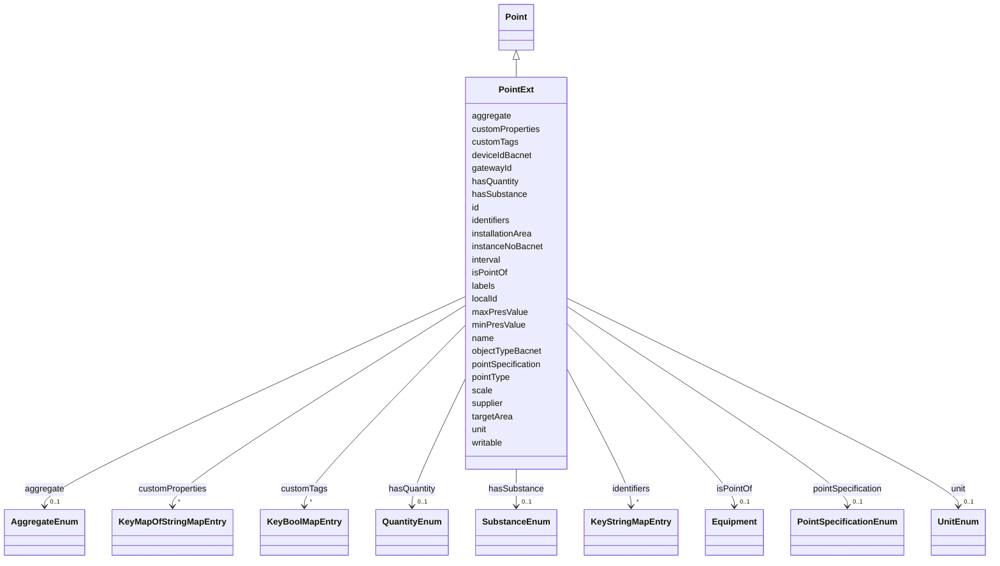

---
search:
  boost: 10.0
---

# Class: PointExt 


_A point (sensor/actuator) in a smart building context._


<div data-search-exclude markdown="1">


URI: [sbco:PointExt](https://www.sbco.or.jp/ont/PointExt)





## Inheritance
* [Point](Point.md)
    * **PointExt**


## Class Properties

| Property | Value |
| --- | --- |
| Class URI | [sbco:PointExt](https://www.sbco.or.jp/ont/PointExt) |


## Slots

| Name | Cardinality and Range | Description | Inheritance |
| ---  | --- | --- | --- |
| [pointSpecification](pointSpecification.md) | 0..1 <br/> [PointSpecificationEnum](PointSpecificationEnum.md) | Point specification category as shown in equipment point list | direct |
| [pointType](pointType.md) | 1 <br/> [String](String.md) | Point type - a profile or template name used to refer to the telemetry format... | direct |
| [unit](unit.md) | 0..1 <br/> [UnitEnum](UnitEnum.md) | Measurement unit (enum key; symbol can be taken from annotations) | direct |
| [maxPresValue](maxPresValue.md) | 0..1 <br/> [Float](Float.md) | Maximum plausible reading | direct |
| [minPresValue](minPresValue.md) | 0..1 <br/> [Float](Float.md) | Minimum plausible reading | direct |
| [scale](scale.md) | 0..1 <br/> [Float](Float.md) | Scale factor for raw value conversion | direct |
| [writable](writable.md) | 0..1 <br/> [Boolean](Boolean.md) | Whether the point value can be written (commanded) | direct |
| [interval](interval.md) | 0..1 <br/> [Integer](Integer.md) | Polling or reporting interval in seconds | direct |
| [gatewayId](gatewayId.md) | 0..1 <br/> [String](String.md) | Identifier of the gateway device managing this point | direct |
| [localId](localId.md) | 0..1 <br/> [String](String.md) | Local identifier for this point within the gateway or system | direct |
| [supplier](supplier.md) | 0..1 <br/> [String](String.md) | Supplier or vendor of the device associated with this point | direct |
| [installationArea](installationArea.md) | 0..1 <br/> [String](String.md) | Parent installation area | direct |
| [targetArea](targetArea.md) | 0..1 <br/> [String](String.md) | Target area for this resource | direct |
| [deviceIdBacnet](deviceIdBacnet.md) | 0..1 <br/> [String](String.md) | BACnet device identifier | direct |
| [instanceNoBacnet](instanceNoBacnet.md) | 0..1 <br/> [String](String.md) | BACnet object instance number | direct |
| [labels](labels.md) | * <br/> [String](String.md) | Labels or tags associated with this point | direct |
| [objectTypeBacnet](objectTypeBacnet.md) | 0..1 <br/> [String](String.md) | BACnet object type (e | direct |
| [id](id.md) | 1 <br/> [String](String.md) | Unique identifier within the schema | [Point](Point.md) |
| [isPointOf](isPointOf.md) | 0..1 <br/> [Equipment](Equipment.md)&nbsp;or&nbsp;<br />[EquipmentExt](EquipmentExt.md) | Equipment that this point belongs to | [Point](Point.md) |
| [aggregate](aggregate.md) | 0..1 <br/> [AggregateEnum](AggregateEnum.md) | Aggregation function or method for point data processing | [Point](Point.md) |
| [customProperties](customProperties.md) | * <br/> [KeyMapOfStringMapEntry](KeyMapOfStringMapEntry.md) | map(string -> map(string -> string)) | [Point](Point.md) |
| [customTags](customTags.md) | * <br/> [KeyBoolMapEntry](KeyBoolMapEntry.md) | map(string -> boolean) | [Point](Point.md) |
| [hasQuantity](hasQuantity.md) | 0..1 <br/> [QuantityEnum](QuantityEnum.md) | Physical quantity measured by this point | [Point](Point.md) |
| [hasSubstance](hasSubstance.md) | 0..1 <br/> [SubstanceEnum](SubstanceEnum.md) | Substance associated with this point | [Point](Point.md) |
| [identifiers](identifiers.md) | * <br/> [KeyStringMapEntry](KeyStringMapEntry.md) | map(string -> string) | [Point](Point.md) |
| [name](name.md) | 1 <br/> [String](String.md) | Machine or Human-readable name | [Point](Point.md) |


## Usages

| used by | used in | type | used |
| ---  | --- | --- | --- |
| [Architecture](Architecture.md) | [hasPoint](hasPoint.md) | any_of[range] | [PointExt](PointExt.md) |
| [Site](Site.md) | [hasPoint](hasPoint.md) | any_of[range] | [PointExt](PointExt.md) |
| [Building](Building.md) | [hasPoint](hasPoint.md) | any_of[range] | [PointExt](PointExt.md) |
| [Level](Level.md) | [hasPoint](hasPoint.md) | any_of[range] | [PointExt](PointExt.md) |
| [Room](Room.md) | [hasPoint](hasPoint.md) | any_of[range] | [PointExt](PointExt.md) |
| [Zone](Zone.md) | [hasPoint](hasPoint.md) | any_of[range] | [PointExt](PointExt.md) |
| [OutdoorSpace](OutdoorSpace.md) | [hasPoint](hasPoint.md) | any_of[range] | [PointExt](PointExt.md) |
| [Asset](Asset.md) | [hasPoint](hasPoint.md) | any_of[range] | [PointExt](PointExt.md) |
| [Equipment](Equipment.md) | [hasPoint](hasPoint.md) | any_of[range] | [PointExt](PointExt.md) |
| [EquipmentExt](EquipmentExt.md) | [hasPoint](hasPoint.md) | any_of[range] | [PointExt](PointExt.md) |


## Identifier and Mapping Information


### Annotations

| property | value |
| --- | --- |
| description_ja | スマートビルディングの文脈におけるポイント（センサー/アクチュエータ）。 |


### Schema Source


* from schema: https://www.sbco.or.jp/ont/schema


## Mappings

| Mapping Type | Mapped Value |
| ---  | ---  |
| self | sbco:PointExt |
| native | sbco:PointExt |


## LinkML Source

<!-- TODO: investigate https://stackoverflow.com/questions/37606292/how-to-create-tabbed-code-blocks-in-mkdocs-or-sphinx -->

### Direct

<details>
```yaml
name: PointExt
annotations:
  description_ja:
    tag: description_ja
    value: スマートビルディングの文脈におけるポイント（センサー/アクチュエータ）。
description: A point (sensor/actuator) in a smart building context.
from_schema: https://www.sbco.or.jp/ont/schema
is_a: Point
slots:
- pointSpecification
- pointType
- unit
- maxPresValue
- minPresValue
- scale
- writable
- interval
- gatewayId
- localId
- supplier
- installationArea
- targetArea
- deviceIdBacnet
- instanceNoBacnet
- labels
- objectTypeBacnet
slot_usage:
  isPointOf:
    name: isPointOf
    any_of:
    - range: Equipment
    - range: EquipmentExt
class_uri: sbco:PointExt

```
</details>

### Induced

<details>
```yaml
name: PointExt
annotations:
  description_ja:
    tag: description_ja
    value: スマートビルディングの文脈におけるポイント（センサー/アクチュエータ）。
description: A point (sensor/actuator) in a smart building context.
from_schema: https://www.sbco.or.jp/ont/schema
is_a: Point
slot_usage:
  isPointOf:
    name: isPointOf
    any_of:
    - range: Equipment
    - range: EquipmentExt
attributes:
  pointSpecification:
    name: pointSpecification
    annotations:
      description_ja:
        tag: description_ja
        value: 設備のポイントリストで示される、ポイントの区分を明示。
    description: Point specification category as shown in equipment point list. English
      is recommended.
    from_schema: https://www.sbco.or.jp/ont/schema
    rank: 1000
    owner: PointExt
    domain_of:
    - PointExt
    range: PointSpecificationEnum
  pointType:
    name: pointType
    annotations:
      description_ja:
        tag: description_ja
        value: ポイントタイプ - 機器やポイントから取得できるテレメトリのフォーマットを参照するためのプロファイル名、またはテンプレート名。具体的な定義については、スキーマファイル等で当該タイプについては別途定義される。
    description: Point type - a profile or template name used to refer to the telemetry
      format obtainable from the device or point. Specific definitions are provided
      separately in schema files.
    from_schema: https://www.sbco.or.jp/ont/schema
    rank: 1000
    owner: PointExt
    domain_of:
    - PointExt
    range: string
    required: true
  unit:
    name: unit
    description: Measurement unit (enum key; symbol can be taken from annotations)
    from_schema: https://www.sbco.or.jp/ont/schema
    rank: 1000
    owner: PointExt
    domain_of:
    - PointExt
    range: UnitEnum
  maxPresValue:
    name: maxPresValue
    description: Maximum plausible reading
    from_schema: https://www.sbco.or.jp/ont/schema
    rank: 1000
    owner: PointExt
    domain_of:
    - PointExt
    range: float
  minPresValue:
    name: minPresValue
    description: Minimum plausible reading
    from_schema: https://www.sbco.or.jp/ont/schema
    rank: 1000
    owner: PointExt
    domain_of:
    - PointExt
    range: float
  scale:
    name: scale
    description: Scale factor for raw value conversion
    from_schema: https://www.sbco.or.jp/ont/schema
    rank: 1000
    owner: PointExt
    domain_of:
    - PointExt
    range: float
  writable:
    name: writable
    annotations:
      description_ja:
        tag: description_ja
        value: ポイントの値を書き込み（制御）できるかどうか
    description: Whether the point value can be written (commanded)
    from_schema: https://www.sbco.or.jp/ont/schema
    rank: 1000
    owner: PointExt
    domain_of:
    - PointExt
    range: boolean
  interval:
    name: interval
    annotations:
      description_ja:
        tag: description_ja
        value: ポーリングまたはレポートの間隔（秒）
    description: Polling or reporting interval in seconds
    from_schema: https://www.sbco.or.jp/ont/schema
    rank: 1000
    owner: PointExt
    domain_of:
    - PointExt
    range: integer
  gatewayId:
    name: gatewayId
    annotations:
      description_ja:
        tag: description_ja
        value: このポイントを管理するゲートウェイデバイスの識別子
    description: Identifier of the gateway device managing this point
    from_schema: https://www.sbco.or.jp/ont/schema
    rank: 1000
    owner: PointExt
    domain_of:
    - PointExt
    range: string
  localId:
    name: localId
    annotations:
      description_ja:
        tag: description_ja
        value: ゲートウェイまたはシステム内でのポイントのローカル識別子
    description: Local identifier for this point within the gateway or system
    from_schema: https://www.sbco.or.jp/ont/schema
    rank: 1000
    owner: PointExt
    domain_of:
    - PointExt
    range: string
  supplier:
    name: supplier
    annotations:
      description_ja:
        tag: description_ja
        value: このポイントに関連するデバイスのサプライヤーまたはベンダー
    description: Supplier or vendor of the device associated with this point
    from_schema: https://www.sbco.or.jp/ont/schema
    rank: 1000
    owner: PointExt
    domain_of:
    - PointExt
    range: string
  installationArea:
    name: installationArea
    description: Parent installation area
    from_schema: https://www.sbco.or.jp/ont/schema
    rank: 1000
    owner: PointExt
    domain_of:
    - EquipmentExt
    - PointExt
    range: string
  targetArea:
    name: targetArea
    description: Target area for this resource
    from_schema: https://www.sbco.or.jp/ont/schema
    rank: 1000
    owner: PointExt
    domain_of:
    - EquipmentExt
    - PointExt
    range: string
  deviceIdBacnet:
    name: deviceIdBacnet
    annotations:
      description_ja:
        tag: description_ja
        value: BACnetデバイス識別子
    description: BACnet device identifier
    from_schema: https://www.sbco.or.jp/ont/schema
    rank: 1000
    owner: PointExt
    domain_of:
    - PointExt
    range: string
  instanceNoBacnet:
    name: instanceNoBacnet
    annotations:
      description_ja:
        tag: description_ja
        value: BACnetオブジェクトインスタンス番号
    description: BACnet object instance number
    from_schema: https://www.sbco.or.jp/ont/schema
    rank: 1000
    owner: PointExt
    domain_of:
    - PointExt
    range: string
  labels:
    name: labels
    annotations:
      description_ja:
        tag: description_ja
        value: このポイントに関連するラベルまたはタグ
    description: Labels or tags associated with this point
    from_schema: https://www.sbco.or.jp/ont/schema
    rank: 1000
    owner: PointExt
    domain_of:
    - PointExt
    range: string
    multivalued: true
  objectTypeBacnet:
    name: objectTypeBacnet
    annotations:
      description_ja:
        tag: description_ja
        value: BACnetオブジェクトタイプ（例：Analog-Input、Binary-Output）
    description: BACnet object type (e.g., Analog-Input, Binary-Output)
    from_schema: https://www.sbco.or.jp/ont/schema
    rank: 1000
    owner: PointExt
    domain_of:
    - PointExt
    range: string
  id:
    name: id
    annotations:
      description_ja:
        tag: description_ja
        value: スキーマ内の一意識別子。文字で開始し、DTMI形式もサポート。
      example:
        tag: example
        value: dtmi:example:Building:1
    description: Unique identifier within the schema. Must start with a letter and
      contain only letters, digits, underscores, hyphens, colons, semicolons, or periods.
      DTMI is one acceptable example.
    from_schema: https://www.sbco.or.jp/ont/schema
    rank: 1000
    identifier: true
    owner: PointExt
    domain_of:
    - Space
    - Asset
    - Point
    - Agent
    - Organization
    - BuildingElement
    - ArchitectureArea
    - ArchitectureCapacity
    range: string
    required: true
  isPointOf:
    name: isPointOf
    annotations:
      description_ja:
        tag: description_ja
        value: このポイントが属する設備
    description: Equipment that this point belongs to
    from_schema: https://www.sbco.or.jp/ont/schema
    rank: 1000
    slot_uri: brick:isPointOf
    owner: PointExt
    domain_of:
    - Point
    range: Equipment
    any_of:
    - range: Equipment
    - range: EquipmentExt
  aggregate:
    name: aggregate
    annotations:
      description_ja:
        tag: description_ja
        value: ポイントデータ処理のための集約関数または方法
      azure_dtdl_type:
        tag: azure_dtdl_type
        value: DTObjectInfo
    description: Aggregation function or method for point data processing
    from_schema: https://www.sbco.or.jp/ont/schema
    rank: 1000
    slot_uri: brick:aggregate
    owner: PointExt
    domain_of:
    - Point
    range: AggregateEnum
  customProperties:
    name: customProperties
    description: map(string -> map(string -> string))
    from_schema: https://www.sbco.or.jp/ont/schema
    rank: 1000
    slot_uri: rec:customProperties
    owner: PointExt
    domain_of:
    - Space
    - Asset
    - Point
    - Information
    - PostalAddress
    - Agent
    - Organization
    - BuildingElement
    - ArchitectureArea
    - ArchitectureCapacity
    range: KeyMapOfStringMapEntry
    multivalued: true
    inlined: true
    inlined_as_list: true
  customTags:
    name: customTags
    description: map(string -> boolean)
    from_schema: https://www.sbco.or.jp/ont/schema
    rank: 1000
    slot_uri: rec:customTags
    owner: PointExt
    domain_of:
    - Space
    - Asset
    - Point
    - Information
    - PostalAddress
    - Agent
    - Organization
    - BuildingElement
    - ArchitectureArea
    - ArchitectureCapacity
    range: KeyBoolMapEntry
    multivalued: true
    inlined: true
    inlined_as_list: true
  hasQuantity:
    name: hasQuantity
    annotations:
      description_ja:
        tag: description_ja
        value: このポイントで測定される物理量
    description: Physical quantity measured by this point
    from_schema: https://www.sbco.or.jp/ont/schema
    rank: 1000
    slot_uri: brick:hasQuantity
    owner: PointExt
    domain_of:
    - Point
    range: QuantityEnum
  hasSubstance:
    name: hasSubstance
    annotations:
      description_ja:
        tag: description_ja
        value: このポイントに関連する物質
    description: Substance associated with this point
    from_schema: https://www.sbco.or.jp/ont/schema
    rank: 1000
    slot_uri: brick:hasSubstance
    owner: PointExt
    domain_of:
    - Point
    range: SubstanceEnum
  identifiers:
    name: identifiers
    description: map(string -> string)
    from_schema: https://www.sbco.or.jp/ont/schema
    rank: 1000
    slot_uri: rec:identifiers
    owner: PointExt
    domain_of:
    - Space
    - Asset
    - Point
    - Information
    - PostalAddress
    - Agent
    - Organization
    - BuildingElement
    - ArchitectureArea
    - ArchitectureCapacity
    range: KeyStringMapEntry
    required: false
    multivalued: true
    inlined: true
    inlined_as_list: true
  name:
    name: name
    description: Machine or Human-readable name
    from_schema: https://www.sbco.or.jp/ont/schema
    rank: 1000
    slot_uri: rec:name
    owner: PointExt
    domain_of:
    - Space
    - Asset
    - Point
    - Information
    - PostalAddress
    - Agent
    - Organization
    - BuildingElement
    - ArchitectureArea
    - ArchitectureCapacity
    range: string
    required: true
class_uri: sbco:PointExt

```
</details></div>