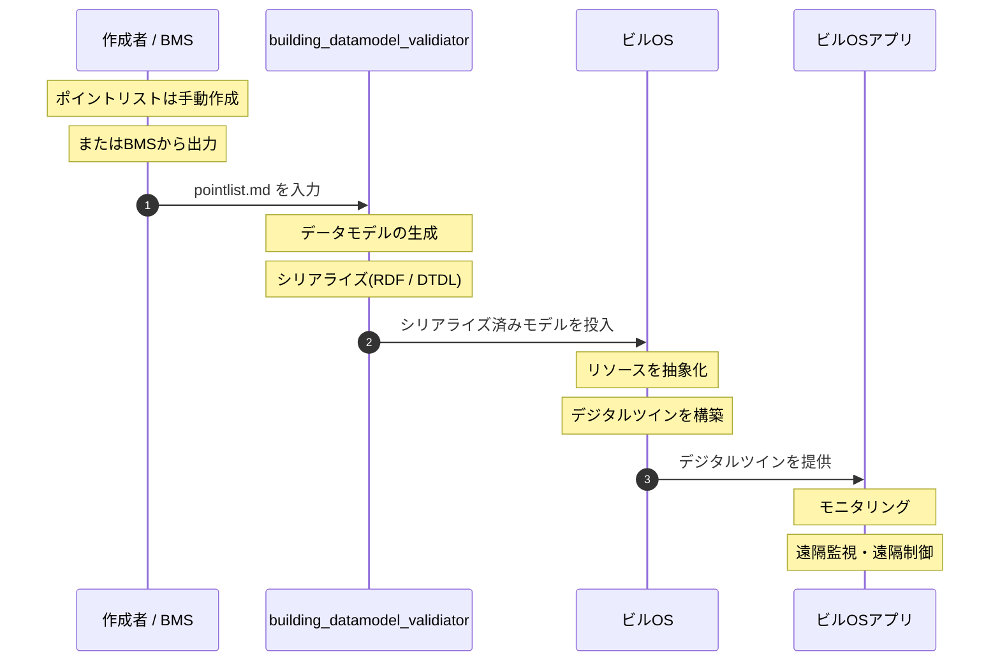

# スマートビルにおけるデータ生成と利活用のフロー

## 目的
pointlist.md のポイントリストを起点に、データモデルの生成からビルOSでの利活用までの流れを整理する。

## 全体像
1. `pointlist.md` に基づき、設備・ポイント・空間などの要素を定義する。
2. `building_datamodel_validiator` がデータモデルを生成・修正・出力し、必要な検証も行う。
3. 生成されたデータモデルを RDF や DTDL などにシリアライズする。
4. シリアライズしたモデルをビルOSと呼ぶプラットフォームに入力する。
5. ビルOS上で建物のリソースが抽象化され、デジタルツインが構築される。
6. デジタルツインを介してモニタリングと遠隔制御が可能になる。

## 役割整理
- `pointlist.md`
  - 入力となるポイント定義の基準
  - 設備、ポイント、位置情報、タグ、単位などを提供

- `building_datamodel_validator`（[smartbuilding_datamodel_builder](https://github.com/smartbuilding-co-creation-organization/smartbuilding_datamodel_builder)）
  - ブラウザ上で動作するWebアプリ（`pnpm dev` でローカル起動）
  - CSVの読み込み・ツリー表示・バリデーション・編集
  - RDF / DTDL / JSON-LD などの出力を支援
  - オントロジー定義は [smartbuilding_datamodels](https://github.com/smartbuilding-co-creation-organization/smartbuilding_datamodels) を参照

- ビルOSプラットフォーム
  - シリアライズ済みモデルの受け入れ
  - リソースの抽象化
  - デジタルツインによる運用

## プロセスフロー


## メモ
- モデルの変更や追記は `building_datamodel_validator` で一貫して行う。
- シリアライズ形式は用途に応じて選択し、ビルOS側の受け入れ仕様に合わせる。

## 出力例（RDF Turtle）

`pointlist.md` のサンプルデータ（GW001/DEV001/PT001）がRDF Turtleにシリアライズされると以下のようになります：

```turtle
@prefix sbco: <https://www.sbco.or.jp/ont/> .
@prefix ex:   <https://example.com/tokyosite1/> .

ex:room_3f_conf101 a sbco:Room ;
    sbco:id "room_3f_conf101" ; sbco:name "会議室101" .

ex:device_dev001 a sbco:EquipmentExt ;
    sbco:id "DEV001" ; sbco:name "温度センサー01" ;
    sbco:deviceType "Sensor" ;
    sbco:locatedIn ex:room_3f_conf101 .

ex:point_pt001 a sbco:PointExt ;
    sbco:id "PT001" ; sbco:name "室温センサー" ;
    sbco:pointSpecification <https://www.sbco.or.jp/ont/PointSpecificationEnum#Measurement> ;
    sbco:unit <https://www.sbco.or.jp/ont/UnitEnum#celsius> ;
    sbco:isPointOf ex:device_dev001 .
```

クラス定義（`sbco:EquipmentExt`、`sbco:PointExt` など）は `smartbuilding_datamodels/output/building_model.owl.ttl` に収録されています。
